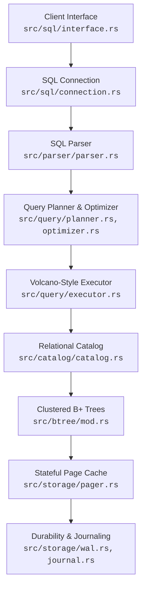

# Hematite Architectural Guide

Hematite is an embeddable, transactional SQL database engine written in Rust. It is designed to serve both as a functional embedded storage manager and as an educational reference for database design.

The system relies on a unidirectional layered architecture, where high-level SQL components translate logical commands into physical operations on a B-tree-backed page store.

---

## 1. Subsystem Layers and Unidirectional Flow

Hematite is structured into distinct layers. Dependencies flow strictly from top (client interface) to bottom (OS filesystem):



### Layer Responsibilities

1. **Client Interface (`sql::interface`)**: Exposes the user-facing API (`Hematite` struct).
2. **SQL Connection (`sql::connection`)**: Manages session state, coordinates autocommit and explicit transaction states, savepoint stacks, and views expansion.
3. **SQL Parser (`parser`)**: Lexes raw text into tokens and parses them using a strict, hand-written recursive-descent parser to construct a logical AST.
4. **Query Planner & Optimizer (`query::planner`, `query::optimizer`)**: Resolves schema bindings, validates expressions, executes constant folding, logical simplifications, and translates the logical AST into a physical execution program.
5. **Query Executor (`query::executor`)**: Formulates Volcano-style iterator pipelines. Operators pull data lazily via a `next()` pattern, abstracting table/index scans, filtering, aggregation, and sorting.
6. **Relational Catalog (`catalog`)**: Translates relational schema elements (tables, columns, types) into low-level B-Tree key-value pairs. Represents types via `Value` and serializes records into packed binary arrays.
7. **B+ Trees (`btree`)**: Implements internal routing nodes and leaf data nodes. Manages node splitting, merging, keys binary search, and lazy node decoding.
8. **Pager (`storage::pager`)**: Manages the LRU in-memory page cache, handles page allocation/freelists, and tracks dirty frames.
9. **Journaling (`storage::wal` & `storage::journal`)**: Coordinates writes to ensure crash safety. Implements either page-undo Rollback journaling or frame-redo Write-Ahead Logging.

---

## 2. Query Lifecycle Dataflow

When a client connection executes a query, the request travels down the engine pipeline. Below is the lifecycle of a `SELECT` query utilizing a secondary index lookup:

```mermaid
sequenceDiagram
    autonumber
    actor Client as Client Connection<br>"SELECT name FROM users WHERE age = 30;"
    participant Parser as Parser / AST<br>[Tokens]
    participant Planner as Planner & Optimizer<br>[Logical Plan]
    participant Executor as Executor / Cursor<br>[SelectExecutor]
    participant BTree as B-Tree / Pager<br>[BTreePage]

    Client->>Parser: Parse()
    Parser->>Planner: Plan & Optimize()
    Planner->>Executor: Execute()
    Executor->>BTree: Open Cursor
    Note over BTree: Read physical page 2 (Leaf)
    BTree-->>Executor: Row bytes (Lazy Node)
    Note over Executor: Decode record
    Note over Executor: Filter by age = 30
    Note over Executor: Project column "name"
    Executor-->>Client: [Rows Output]
```

1. **Parse Phase**: Raw query text is tokenized and verified against Hematite's strict SQL grammar rules. Keywords are checked for mandatory uppercase casing. A `Statement::Select` AST is returned.
2. **Planning & Optimization**: The query is validated against active catalog schemas (checking that the table `users` and columns `name` and `age` exist). The query optimizer performs constant folding and simplifies expression paths. A physical `ExecutionProgram` is chosen.
3. **Execution**: The executor builds a Volcano iterator chain. An index scan cursor searches the secondary index tree for `age = 30`. It extracts matching `rowid` keys, then performs a point-lookup on the main clustered table to retrieve the complete rows.
4. **Data Retrieval**: Cursors query the B-Tree module, which asks the Pager for the required page numbers. The Pager reads them from the file (or cache) and serves them as byte blocks.
5. **Project & Emit**: The executor extracts and formats the requested `name` value, converting it into a user-facing `QueryResult` container.

---

## 3. Concurrency Model: SWMR in WAL Mode

Hematite supports two distinct transactional execution engines: **Rollback Journaling** and **Write-Ahead Logging (WAL)**.

### Rollback Journal Mode

In rollback mode, modifications are executed directly in-place on the main database file. Before any page is modified, its original content is copied to a rollback journal file (`.jrnl`).

* **Concurrency Lockout**: Readers and writers cannot proceed concurrently. A transaction holds a writer lock on the catalog, preventing any concurrent reader threads from accessing the database to avoid seeing partial or dirty state.
* **Rollback & Recovery**: If a transaction aborts or the engine crashes mid-flight, the recovery coordinator replays the rollback journal, copying the original pages back into the main database file.

### WAL Mode (Single-Writer, Multiple-Reader)

In WAL mode, updates are not written in-place to the database. Instead, all modified pages are appended as redone frames to a separate Write-Ahead Log file (`.wal`).

* **Reader Isolation**: Readers do not access the WAL file directly for writes. They open a transaction snapshot aligned with the current end of the WAL file. When reading page `N`, the pager checks its in-memory index of WAL frames. If page `N` has been written in the current transaction scope, it is read from the WAL file. Otherwise, it is fetched from the main database file.
* **Writer Flow**: Writers append new page frames to the end of the WAL. They do not block readers, as readers still see their historical snapshot of the main file and pre-committed WAL positions.
* **Checkpointing**: Periodically, the WAL changes are flushed back into the main database file in page-number order (checkpointing), shrinking the WAL.

#### Comparison: Hematite vs. SQLite Concurrency

| Feature | SQLite Concurrency | Hematite Concurrency |
| --- | --- | --- |
| **Locking Mechanism** | OS-level file locks (Shared, Reserved, Pending, Exclusive) | In-memory catalog mutex locking (`Arc<Mutex<Catalog>>`) |
| **Concurrency Limit** | Multiple reader processes, single writer process | Multiple in-process reader threads, single writer thread |
| **Commit Boundary** | Handled through physical file locks and WAL header updates | Handled via catalog transactions and frame-based checksum boundaries |

---

## 4. File and Physical Page Layout

Unlike standard SQLite, which merges the main database header and the first table root page payload directly into Page 1, Hematite enforces a strict separation between database headers, transaction metadata, and allocatable data B-trees.

### Physical Layout of a Hematite Database File

| Page 0<br>**Database Header** | Page 1<br>**Storage Metadata** | Page 2+<br>**Allocatable Trees** |
| :--- | :--- | :--- |
| 100 bytes reserved | Magic `HMD1` | Slotted Pages |

* **Page 0 (`DB_HEADER_PAGE_ID`)**: The first 100 bytes are reserved. A 20-byte database header is written at the start, containing: magic code `HMTD` (4 bytes), format version `2` (4 bytes), schema B-tree root page ID (4 bytes), next table ID (4 bytes), and header checksum (4 bytes). All header integers are little-endian. The remaining 80 bytes are zero padding. Page size is a compile-time constant (`4096`), not stored in the header.
* **Page 1 (`STORAGE_METADATA_PAGE_ID`)**: A dedicated metadata container starting with the container magic `HMD1`. It stores pager state (journal mode, free pages, per-page checksums) and catalog runtime metadata (table row counts, next rowid).
* **Page 2 and onwards (`FIRST_ALLOCATABLE_PAGE_ID`)**: Usable physical pages. These are allocated for clustered table B-trees, secondary index B-trees, or overflow page chains.

---

## 5. ACID Guarantees

Hematite guarantees standard transactional properties (ACID) to ensure database integrity:

* **Atomicity**: Transactions are fully atomic. In Rollback mode, the entire journal must be successfully flushed to disk before any in-place write. If a failure occurs, the journal is replayed to wipe out partial changes. In WAL mode, a transaction commits only when its final frame group commit-boundary is written with valid checksums. Partial transactions are ignored.
* **Consistency**: DB constraints are verified before a transaction commits. B-Tree leaf and internal node order invariants are checked recursively at validation checkpoints, preventing structure corruption.
* **Isolation**: Supports `SERIALIZABLE` isolation within a single session. Session updates acquire exclusive write-locks, protecting reader threads from dirty reads, non-repeatable reads, or phantom reads.
* **Durability**: Modified pages are guaranteed to survive system crashes. Disk synchronization (`fsync` or equivalent) is invoked during key transactional boundaries: before main-file modification (in rollback mode), or upon writing commit-boundaries to the WAL file.

---

## 6. Design Intent

Hematite is built with the following core design guidelines:

* **Understandability over Complexity**: The codebase prefers direct, clear code paths. Simplifications are embraced where they do not hurt correctness or safety (e.g. unified decimal numeric calculations, single-statement trigger bodies).
* **Strict Dialect & Case Enforcement**: Enforcing uppercase keywords keeps parsing deterministic, preventing complex and fragile grammar ambiguity rules.
* **Educational Architecture**: By maintaining clean boundaries between the logical query layer, the physical catalog manager, and the low-level storage engines, developers can learn B-tree internals and physical SQL engine query flow directly from the codebase.
