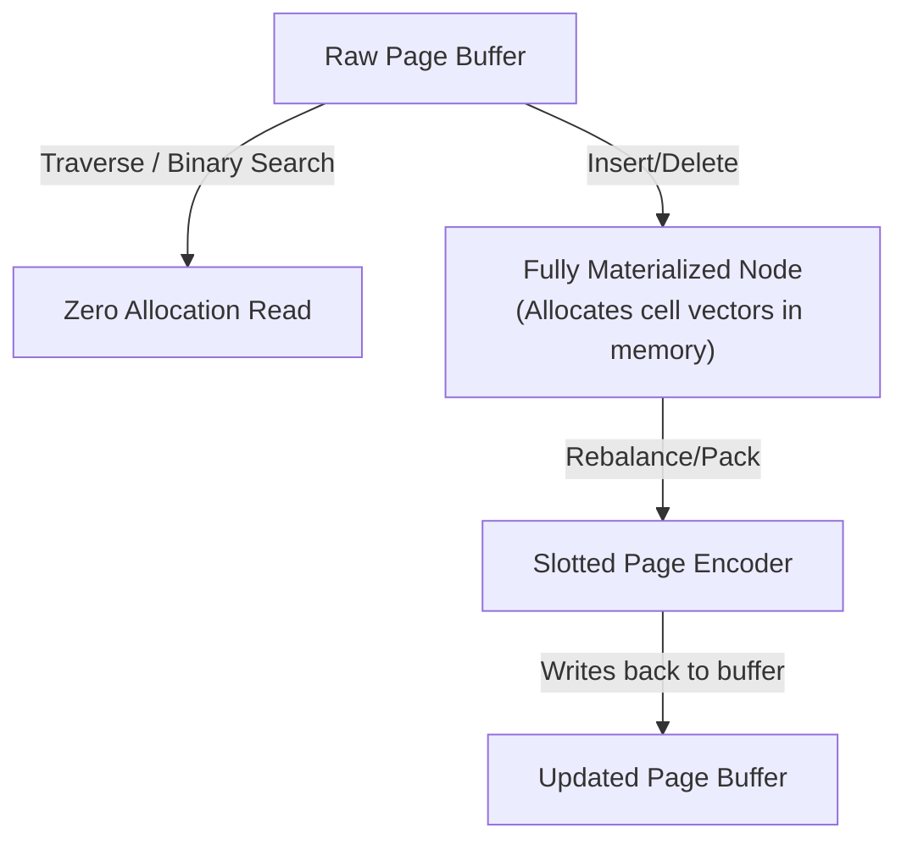

# Hematite Codebase Guide

This document provides a comprehensive map of the Hematite codebase, explaining where specific components reside, how they interact, and how to extend the database engine.

---

## 1. Directory and Submodule Architecture

The codebase is organized into six primary layers:

```text
src/
├── main.rs                       # CLI entry point
├── lib.rs                        # Public API exports
│
├── sql/                          # 1. SQL Interface & Session Layer
│   ├── interface.rs              # Hematite facade and public API
│   ├── connection.rs             # Connection coordinator, transactions, autocommit
│   ├── result.rs                 # QueryResult, Row, Value conversions
│   └── script.rs                 # Script step iterator
│
├── parser/                       # 2. Lexer, Parser, & SQL AST
│   ├── lexer.rs                  # SQL tokenizer
│   ├── parser.rs                 # Hand-written recursive-descent parser
│   ├── ast.rs                    # AST node definitions (SelectStatement, etc.)
│   └── types.rs                  # Parser-owned SQL type names
│
├── query/                        # 3. Validation, Optimization, Planning & Execution
│   ├── validation.rs             # Semantic analysis and type verification
│   ├── planner.rs                # Physical execution plan builder
│   ├── plan.rs                   # Query plan structures and access-path descriptions
│   ├── optimizer.rs              # AST optimizer (constant folding, logical identity folds)
│   ├── rewrite.rs                # Pre-planner AST rewrites (BETWEEN→range, OR→IN, HAVING→WHERE)
│   ├── executor.rs               # Volcano iterator execution engine
│   ├── lowering.rs               # AST syntax-to-runtime Value lowering
│   ├── logest.rs                 # Logarithmic cost estimation (SQLite-style LogEst)
│   ├── predicate.rs              # Predicate analysis helpers
│   ├── runtime.rs                # Runtime query context
│   ├── metadata.rs               # Formatting show/describe results
│   └── tests.rs                  # Query layer integration tests
│
├── catalog/                      # 4. Relational Schema Manager
│   ├── mod.rs                    # Module entry and re-exports
│   ├── catalog.rs                # Relational database facade (CREATE, DROP, ALTER)
│   ├── engine.rs                 # Storage engine metadata mapper
│   ├── engine_metadata.rs        # Table metadata persistence codec
│   ├── schema.rs                 # In-memory schema definitions registry
│   ├── schema_store.rs           # Schema B-tree serialization/deserialization
│   ├── table.rs                  # Tables, columns, index constraints metadata
│   ├── table_store.rs            # Table row CRUD operations
│   ├── column.rs                 # Column definitions and DDL operations
│   ├── header.rs                 # Database header struct and serialization
│   ├── ids.rs                    # TableId, ColumnId type wrappers
│   ├── index_store.rs            # Primary key and secondary index B-tree operations
│   ├── integrity.rs              # Catalog integrity validation
│   ├── object.rs                 # Views, triggers, named constraints
│   ├── record.rs                 # StoredRow type definition
│   ├── runtime_metadata.rs       # Runtime table metadata (row counts, next rowid)
│   ├── cursor.rs                 # Table and index cursor abstractions
│   ├── serialization.rs          # Packed logical row byte-array encoder
│   ├── types.rs                  # Value variants (Date, Time, Decimal, etc.)
│   └── tests.rs                  # Catalog layer tests
│
├── btree/                        # 5. Clustered B+ Trees
│   ├── mod.rs                    # B-tree module entry (key/value types, re-exports)
│   ├── bytes.rs                  # ByteTreeStore / ByteTree / ByteTreeCursor facade
│   ├── typed.rs                  # TypedTreeStore / TypedTree / TypedTreeCursor facade
│   ├── codec.rs                  # KeyValueCodec trait and RawBytesCodec identity impl
│   ├── node.rs                   # B-Tree page lazy node decoder and mutation logic
│   ├── page_format.rs            # Slotted page allocator and cell layout
│   ├── cursor.rs                 # Stack-based cursor for leaf traversals and scans
│   ├── index.rs                  # B-tree mutation algorithms (insert, delete, split, merge)
│   ├── tree.rs                   # Tree lifecycle (create, open, delete, reset, validate)
│   ├── value_store.rs            # Inline/overflow value wrapper (StoredValueLayout)
│   └── tests.rs                  # B-tree layer tests
│
└── storage/                      # 6. Physical Page Cache & Durability (The Foundation)
    ├── mod.rs                    # Storage subsystem entry (Pager & page type exports)
    ├── types.rs                  # Core types: PAGE_SIZE, PageId, Page, reserved page IDs
    ├── format.rs                 # Storage format constants (DATABASE_HEADER_SIZE, PageKind)
    ├── file_manager.rs           # OS file handles, random I/O reads/writes, and fsync
    ├── pager.rs                  # Stateful page buffer cache (LRU cache, dirty flags)
    ├── pager/                    # Pager core implementation details
    │   ├── cache.rs              # LRU cache implementation and eviction logic
    │   ├── core.rs               # Basic pager structure and frame buffers
    │   ├── integrity.rs          # Pager integrity validation and accounting
    │   ├── journal.rs            # Pager-level journal coordination
    │   ├── locking.rs            # Shared/Exclusive reader-writer transaction locks
    │   ├── page_io.rs            # Page read/write dispatch (file vs. WAL overlay)
    │   ├── reader.rs             # Read transaction snapshot management
    │   ├── recovery.rs           # Coordinator to replay journal frames after crash
    │   ├── savepoint.rs          # Savepoint stack management
    │   ├── space.rs              # Page space allocation and tracking
    │   ├── state.rs              # Pager state machine definitions
    │   ├── wal.rs                # Pager-level WAL coordination
    │   └── tests.rs              # Pager tests
    ├── wal.rs                    # Write-Ahead Log (WAL) frame appending and checkpointing
    ├── journal.rs                # Rollback undo journal management
    ├── metadata_page.rs          # Storage metadata page container (HMD1 format)
    ├── pager_metadata.rs         # Pager metadata section codec (HPM1 format)
    ├── overflow.rs               # Overflow page chain reading and writing
    └── free_list.rs              # Page allocator and deleted page reuse
```

---

## 2. Layer-by-Layer Subsystem Tour

### 1. SQL Layer (`src/sql/`)

Acts as the entry boundary for user queries. It coordinates session state and transaction boundaries.

* **`interface.rs`**: The primary wrapper (`Hematite`). It opens databases, routes statements, and exposes clean public APIs.
* **`connection.rs`**: Manages explicit transaction boundaries (`BEGIN`, `COMMIT`, `ROLLBACK`), handles autocommit behavior, tracks the active catalog snapshot, and handles nesting of `SAVEPOINT`s.

### 2. Parser Layer (`src/parser/`)

Translates raw SQL query strings into a logical AST.

* **`lexer.rs`**: Tokenizes input strings. Strict keyword matching requires uppercase (e.g. `SELECT` is recognized, `select` is rejected).
* **`parser.rs`**: A hand-written recursive-descent parser. It avoids heavy parser generator dependencies, making syntax extensions easy to implement.
* **`ast.rs`**: Defines AST nodes. Nodes are completely isolated from storage or catalog runtimes.

### 3. Query Layer (`src/query/`)

Compiles the AST into an execution plan and runs it.

* **`validation.rs`**: Resolves table/column names against the schema catalog, infers and enforces SQL types, and rejects semantic invalidity.
* **`planner.rs`**: Generates a physical execution plan, translating AST filters and projections into concrete runtime operations.
* **`optimizer.rs` & `rewrite.rs`**: Performs rule-based optimization, constant folding, and selects scan indexes.
* **`executor.rs`**: A volcano-style pull iterator engine. Every executor (e.g. `FilterExecutor`, `JoinExecutor`) yields rows via a `next()` pattern. It hosts expression evaluation, aggregate operators, window functions, and recursive CTE runtime.

### 4. Catalog Layer (`src/catalog/`)

Bridges relational tables and low-level B-Tree bytes.

* **`catalog.rs`**: Manages relational metadata (active tables, schema, views, triggers, and indices).
* **`serialization.rs`**: Packs logical records into binary byte-arrays. It serializes data types (`Value`) using a compact, schema-defined packed representation to conserve disk space.
* **`types.rs`**: Implements high-precision `DecimalValue` math, `DateValue`, `TimeValue`, and interval arithmetic.

### 5. B-Tree Layer (`src/btree/`)

Implements clustered B+ Trees that act as physical table storage.

* **`node.rs` & `page_format.rs`**: Implements slotted pages where rows grow from the end of the page backward and pointer lists grow from the header forward. Supports zero-allocation lazy decoding for read-only lookups.
* **`cursor.rs`**: Traverses leaf pages, moving forward or backward to support indexed range scans.

### 6. Storage Layer (`src/storage/`)

Manages direct disk files, cache memory, and durability.

* **`pager.rs`**: Coordinates in-memory page frame allocations, tracking dirty pages, and page locks.
* **`wal.rs` & `journal.rs`**: Implements redo/undo log managers. Ensures the Write-Ahead Log is synced to disk during commit before modifying the main database file.
* **`free_list.rs`**: Manages free pages, recycling deleted pages instead of letting database files grow indefinitely.
* **`overflow.rs`**: Allocates chains of overflow pages for keys or values larger than a physical page.

---

## 3. Developer Extension Guides

### How to Add New SQL Syntax

To implement new SQL dialect commands, follow these steps:

1. **Lexer (`src/parser/lexer.rs`)**:
   * Add new keywords to the `Token` enum.
   * Update the keyword match dictionary in `lexer.rs` (ensure keywords are in uppercase).
2. **AST (`src/parser/ast.rs`)**:
   * Define a new statement type variant in the `Statement` enum (e.g., `Statement::AlterRenameTable`).
   * Create supporting structs for statement parameters.
3. **Parser (`src/parser/parser.rs`)**:
   * Add a routing branch in the top-level `Parser::parse` method.
   * Implement a hand-written parsing function (e.g., `parse_alter_rename_table`) using token consumption helpers like `consume_token`.
4. **Lowering & Validation (`src/query/validation.rs`)**:
   * Add validation rules to check table existence, column permissions, and compatibility.
5. **Execution (`src/query/executor.rs`)**:
   * Create a physical plan representation and executor implementing the `QueryExecutor` trait.
   * Implement `execute()`, updating the `Catalog` or storage cursors.
   * Route the new plan in `build_executor()`.

### How to Add a Built-in SQL Scalar Function

To add a new built-in scalar function (e.g. `UPPER(x)`, `ABS(x)`):

1. **Parser AST (`src/parser/ast.rs`)**:
   * Register the function identifier name in the `ScalarFunction` enum (e.g., `ScalarFunction::MyNewFunc`).
2. **Parser parsing (`src/parser/parser.rs`)**:
   * Update `parse_function_call` or keyword mappings to parse your function name and bind it to the new `ScalarFunction` enum variant.
3. **Validation (`src/query/validation.rs`)**:
   * Add a match arm in the expression validator to verify function arity and argument types.
4. **Executor (`src/query/executor.rs`)**:
   * Implement the function evaluation logic (e.g., `evaluate_my_new_func`).
   * Add a match arm in `evaluate_scalar_function` routing to your implementation.
5. **Tests**:
   * Add a query test case inside `src/query/tests.rs` or `src/sql/tests.rs` verifying SQL-level execution.

### How to Add a New Runtime Type

To introduce a new database column data type (e.g. `UUID`, `JSON`):

1. **Parser Types (`src/parser/types.rs`)**:
   * Add the SQL type to the `SqlTypeName` enum.
   * Update `parse_type_name` in the parser to recognize the syntax keyword.
2. **Catalog Types (`src/catalog/types.rs`)**:
   * Add the physical type representation to the `DataType` enum.
   * Add the concrete data value variant to the `Value` enum.
3. **Serialization (`src/catalog/serialization.rs`)**:
   * Update the logical row encoder (`serialize_row`) to serialize the new type variant.
   * Update the logical row decoder (`deserialize_row`) to deserialize the bytes back into the `Value` variant.
4. **Operations and Casts (`src/query/lowering.rs`, `src/query/executor.rs`)**:
   * Register comparison functions, sorting support, and cast coercions in the executor.
5. **Write Tests**:
   * Add schema creation and value insertion tests to `src/catalog/tests.rs` and database interface tests in `src/sql/tests.rs`.

### How to Add a Metadata Command

To add introspection commands (such as `SHOW SCHEMAS` or `DESCRIBE DATABASE`):

1. **Parse AST**: Define the token routing in `src/parser/lexer.rs` and `src/parser/parser.rs`.
2. **Format Output (`src/query/metadata.rs`)**:
   * Implement layout structuring in `query::metadata`. Introspection output is returned as standard table rows. Add a builder function that returns the appropriate column names and types.
3. **Connection Hook (`src/sql/connection.rs`)**:
   * Intercept the statement in `Connection::execute_statement` and populate the metadata rows by querying the active `Catalog` instance.

---

## 4. B-Tree Lazy Node Decoding and Traversals

B-Trees in Hematite represent nodes as physical pages (`Page`). To avoid expensive memory allocation and CPU overhead, Hematite uses **Lazy Node Decoding** during tree lookups and mutations.

### B-Tree Traversals with Cursors

```text
Cursor Position Search (e.g., search key K)
======================================================
1. Start at Root Page (Page ID fetched from Catalog).
2. Fetch Page buffer from Pager.
3. Wrap Page in BTreeNode using BTreeNode::from_page_lazy().
   --> This does NOT allocate vectors for cells.
4. Perform Binary Search on the cell pointers directly in the page buffer.
5. If Interior Node:
   - Identify routing key boundary.
   - Fetch child Page ID from cell.
   - Repeat from step 2 for child page.
6. If Leaf Node:
   - Locate the exact cell index.
   - Construct BTreeCursor pointing to this offset.
```

### Lazy Node Structure

* **`BTreeNode` (`src/btree/node.rs`)**:
  Represents a B-Tree page. Instead of copying all keys and values into an in-memory vector upon opening, it holds a reference to the raw page buffer. Cell locations are computed on-demand using page offsets.
* **Decoding Boundary**:
  A node is decoded into fully-materialized memory vectors only when modifications are required (e.g., performing a cell insertion, splitting a balanced node, or merging underflow cells). Reads only scan the in-place page bytes.
* **Node Mutation Lifecycle**:


