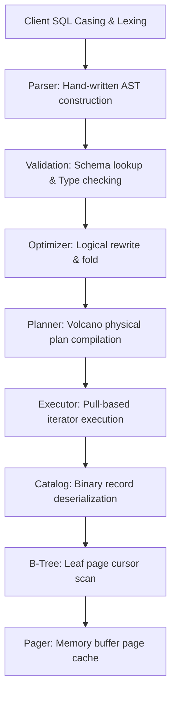

# Query Execution Walkthrough

This document traces the complete lifecycle of a SQL query inside the Hematite database engine. By following a single query from raw text to physical data retrieval, you will see how the different architectural layers interact.

We will trace the execution of this query:
```sql
SELECT name, age FROM users WHERE age > 18 ORDER BY age;
```

---

## 1. Subsystem Execution Path

The query travels down the following layer pipeline:



---

## 2. Phase 1: Lexing & Parsing (`src/parser`)

Before the query can be executed, it must be translated from a raw string of text into a structured data representation that the compiler can understand.

1. **Lexer (`lexer.rs`)**:
   * Tokenizes the raw SQL string into a stream of tokens:
     `SELECT`, `name`, `,`, `age`, `FROM`, `users`, `WHERE`, `age`, `>`, `18`, `ORDER`, `BY`, `age`, `;`.
   * **Strict Casing Rule**: The lexer requires SQL keywords to be in uppercase. If it encounters `select` instead of `SELECT`, it will reject the query.
2. **Parser (`parser.rs`)**:
   * Consumes the token stream and builds a logical AST (Abstract Syntax Tree). Since Hematite's parser is a hand-written recursive-descent parser, it walks the syntax structures directly.
   * The resulting AST variant is `Statement::Select` which contains a `SelectStatement` struct structured like this:

```text
SelectStatement
├── columns: [SelectItem::Column("name"), SelectItem::Column("age")]
├── from: TableReference::Table("users")
├── where_clause: Some(WhereClause {
│     conditions: [
│       Expression::Comparison {
│         left: Expression::Column("age"),
│         operator: ComparisonOperator::GreaterThan,
│         right: Expression::Literal(LiteralValue::Integer(18))
│       }
│     ]
│   })
└── order_by: [OrderByExpr { expr: Expression::Column("age"), asc: true }]
```

---

## 3. Phase 2: Schema Validation (`src/query/validation.rs`)

At this stage, the AST contains only strings (e.g. `"users"`, `"name"`). The database doesn't know if these tables or columns actually exist, or if the query makes sense semantically.

The **Validator** queries the relational **Catalog** to check:
1. **Table Existence**: Does a table named `"users"` exist in the database catalog?
2. **Column Binding**: Do columns named `"name"` and `"age"` exist inside the `"users"` table?
3. **Type Checking**:
   * Resolves the types of the columns from the schema definition (e.g., `name` is `TEXT`, `age` is `INT32`).
   * Verifies that the comparison operator `>` is compatible with the types of the operands:
     `Expression::Column("age")` (integer) `>` `LiteralValue::Integer(18)` (integer) $\to$ **Valid**.

---

## 4. Phase 3: Logical Optimization (`src/query/optimizer.rs`)

The **Query Optimizer** performs logical modifications on the validated AST to simplify expressions and prune redundant logic.
* **Constant Folding**: If our query had been `WHERE age > 10 + 8`, the optimizer would fold the binary arithmetic expression `10 + 8` into the single literal `18` to save CPU cycles at runtime.
* **Logical Identities**: Simplifies clauses (e.g. `WHERE age > 18 AND TRUE` becomes `WHERE age > 18`).

In our query, the optimizer verifies that no further constant folding is needed and passes the AST to the Planner.

---

## 5. Phase 4: Physical Planning (`src/query/planner.rs`)

The **Planner** translates the logical optimized AST into a tree of **Physical Operators** (a query plan) that can be executed. It resolves the access path: should it scan a secondary index on `age` or scan the main table B-Tree?

Assuming `users` has no index on `age`, the planner compiles the logical query into a **Volcano Iterator Plan**:

```text
       [ProjectionExecutor]  (emits only "name", "age")
               │
          [SortExecutor]     (buffers and sorts rows by "age")
               │
         [FilterExecutor]    (keeps rows where age > 18)
               │
       [TableScanExecutor]   (reads raw rows from B-Tree page cursor)
```

---

## 6. Phase 5: Query Execution (`src/query/executor.rs`)

Hematite executes the compiled plan using the **Volcano Iterator Model**. Control flows from the top operator downward via pull-based `next()` calls, and data rows flow upward.

Here is the step-by-step loop execution:

### Step A: Pulling the First Row
1. The client connection calls `next()` on the top-level executor, the **ProjectionExecutor**.
2. **ProjectionExecutor** needs a row, so it calls `next()` on its child, the **SortExecutor**.
3. **SortExecutor** must deliver the smallest row sorted by `age`. To sort, it needs to see *all* matching rows first. Therefore, the SortExecutor enters a loop calling `next()` on its child, the **FilterExecutor**, repeatedly until the FilterExecutor returns `None`.

### Step B: Filtering and Scanning
4. **FilterExecutor** calls `next()` on the **TableScanExecutor**.
5. **TableScanExecutor** queries the **B-Tree Cursor** (`src/btree/cursor.rs`), which is currently positioned at the start of the `users` B-Tree.
6. The B-Tree Cursor reads the current page number (starting at the B-Tree root page ID, and descending to the first leaf page). It requests the **Pager** (`src/storage/pager.rs`) to fetch these pages.
7. The Pager checks its in-memory cache (the buffer pool). If the page is not cached, it directs the **FileManager** to read the 4096-byte page block from the disk file and load it into memory.
8. The B-Tree Cursor reads the leaf page's **Slotted Page Cell pointers** to locate the exact offset of the first record cell on the page. It extracts the raw cell bytes:
   `[Key Length: 2 bytes] [Value Length: 2 bytes] [Key: Row ID] [Value: Packed Columns]`
9. The cursor returns these raw record bytes to the **TableScanExecutor**.

### Step C: Record Deserialization
10. The **TableScanExecutor** passes the raw record bytes to the **Catalog Decoder** (`src/catalog/serialization.rs`).
11. The Decoder reads the table's schema definition and unpacks the binary byte array back into a logical `Row` struct containing typed `Value` variants:
    `Row { columns: [Value::Integer(1), Value::Text("Alice"), Value::Integer(20)] }` (representing `rowid = 1`, `name = "Alice"`, `age = 20`).
12. **TableScanExecutor** yields this `Row` up to the **FilterExecutor**.

### Step D: Evaluating the Predicate
13. **FilterExecutor** evaluates the condition `age > 18` against the row:
    `20 > 18` $\to$ **True**.
14. The FilterExecutor yields the row up to the **SortExecutor**.
15. This process (Steps 4–14) repeats for all records in the table. If a row fails the filter (e.g. `age = 15`), the FilterExecutor silently discards it and calls `next()` on the TableScanExecutor again.

### Step E: Sorting and Emitting
16. Once the TableScanExecutor is exhausted and the FilterExecutor returns `None`, the **SortExecutor** has gathered all qualifying rows in memory.
17. The SortExecutor sorts the rows in-memory by the `age` column using the sorting rules defined in `src/query/executor.rs`.
18. The SortExecutor returns the first sorted row (e.g. `age = 19`) to the **ProjectionExecutor**.
19. **ProjectionExecutor** extracts only the requested fields (`name` and `age`) and discards the other fields (like `rowid`).
20. The ProjectionExecutor returns the projected row to the client connection:
    `QueryResultRow { name: "Bob", age: 19 }`
21. When the client calls `next()` again, the ProjectionExecutor immediately pulls the next pre-sorted row from the SortExecutor, bypassing the scan and filter stages since they have already completed.
