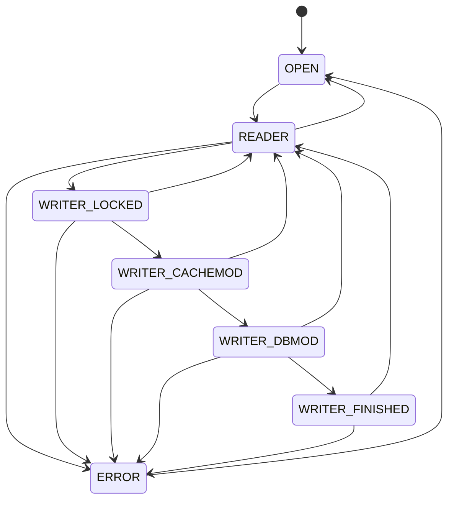

# SQLite B-Tree and Pager: Implementation Notes and Rust Reimplementation Guide

## Scope

This document focuses on the SQLite storage engine below the SQL layer:

- `src/btree.c`
- `src/btree.h`
- `src/btreeInt.h`
- `src/pager.c`
- `src/pager.h`
- `src/pcache.h`
- `src/pcache.c`
- `src/pcache1.c`
- `doc/pager-invariants.txt`
- focused tests in `test/` and `src/test_btree.c`

It intentionally avoids the parser, code generator, VDBE, and platform VFS details except where they directly shape btree or pager behavior.

The target reader is someone building an embedded database in Rust who suspects the main bottlenecks are:

- the btree implementation,
- page cache/pager behavior,
- read/write paths through large rows and overflow pages,
- and the lack of SQLite-style crash-safety and adversarial testing.

## High-Level Architecture

SQLite’s storage stack is layered roughly like this:

1. `Pager`
   Owns the database file, rollback journal or WAL integration, file locks, page cache, savepoints, crash recovery, and page-level durability rules.

2. `PCache`
   Caches `PgHdr` page objects in memory, tracks dirty pages, decides when to spill dirty pages, and provides page pin/unpin semantics.

3. `Btree`
   Understands database page format, cell format, overflow chains, freelist pages, pointer-map pages, cursor navigation, insertion, deletion, balancing, and integrity checking.

The important boundary is:

- pager knows page identity, durability, journaling, locking, cache state;
- btree knows page contents and tree algorithms.

That separation is one of SQLite’s biggest strengths. A Rust reimplementation should preserve it.

## Core Design Ideas Worth Copying

SQLite is fast and robust here because it combines:

- a compact page format with mostly contiguous I/O,
- lazy decoding of cells,
- explicit free-space accounting on each page,
- careful overflow handling,
- a page cache that separates "dirty", "journaled", and "writeable",
- two-phase commit through the pager,
- strong corruption checks at every low-level boundary,
- savepoints implemented at the pager layer,
- and a huge amount of fault-injection and integrity testing.

The system is not "just a btree". It is a btree plus a correctness protocol.

## Part I: The B-Tree

### On-disk page types

SQLite database files are page-oriented. A page may be:

- a btree page,
- a freelist trunk page,
- a freelist leaf page,
- an overflow page,
- or, when auto-vacuum is enabled, a pointer-map page.

Page 1 is special:

- first 100 bytes are the database header,
- the remainder is a normal btree page image.

### Database file header (page 1 only, first 100 bytes)

Page 1 is unique: its first 100 bytes are the database file header. The btree page content starts at byte offset 100. The file header layout is defined in `btreeInt.h` lines 56–100:

```
OFFSET  SIZE  DESCRIPTION
  0      16   Header string: "SQLite format 3\000"
 16       2   Page size in bytes (1 means 65536)
 18       1   File format write version
 19       1   File format read version
 20       1   Reserved bytes per page (unused space at end)
 21       1   Max embedded payload fraction (must be 64)
 22       1   Min embedded payload fraction (must be 32)
 23       1   Min leaf payload fraction (must be 32)
 24       4   File change counter
 28       4   Database size in pages
 32       4   First freelist trunk page
 36       4   Total freelist page count
 40       4   Schema cookie
 44       4   Schema format number
 48       4   Default page cache size
 52       4   Largest root-page (auto/incr_vacuum)
 56       4   Text encoding (1=UTF-8, 2=UTF-16le, 3=UTF-16be)
 60       4   User version
 64       4   Incremental vacuum mode
 68       4   Application-ID
 72      20   Reserved for expansion (zeroed)
 92       4   Version-valid-for number
 96       4   SQLITE_VERSION_NUMBER
```

All integers are big-endian. The change counter at bytes 24–27 is how other connections detect file modifications and invalidate caches (invariant 9 in `pager.c`).

The fractions at offsets 21–23 are **not tunable at runtime**. They are fixed at 64, 32, 32 and define the overflow split formulas. A Rust port must hardcode these values to maintain file format compatibility.

### Btree page layout

A btree page has four regions (`btreeInt.h` lines 106–164):

```
|----------------|
| file header    |   100 bytes. Page 1 only.
|----------------|
| page header    |   8 bytes for leaves. 12 bytes for interior nodes
|----------------|
| cell pointer   |   |  2 bytes per cell. Sorted by key order.
| array          |   |  Grows downward
|                |   v
|----------------|
| unallocated    |
| space          |
|----------------|   ^  Grows upwards
| cell content   |   |  Arbitrary order interspersed with freeblocks
| area           |   |  and free space fragments.
|----------------|
```

#### Page header (8 or 12 bytes)

The exact page header byte layout (`btreeInt.h` lines 128–134):

```
OFFSET  SIZE  DESCRIPTION
  0       1   Flags: PTF_INTKEY=0x01, PTF_ZERODATA=0x02,
              PTF_LEAFDATA=0x04, PTF_LEAF=0x08
  1       2   Byte offset to the first freeblock (0 = no freeblocks)
  3       2   Number of cells on this page
  5       2   Byte offset to first byte of cell content area
  7       1   Number of fragmented free bytes (max 255)
  8       4   Right child pointer (Ptr(N)). OMITTED on leaf pages.
```

This means `MemPage.cellOffset` for page 1 is `100 + 8` (leaf) or `100 + 12` (interior). For all other pages it is `8` or `12`.

#### Cell pointer array

Immediately follows the page header. Each entry is 2 bytes, a big-endian offset from the start of the page to a cell body in the content area. Pointers are maintained in key-sorted order. The array grows downward toward the cell content area.

#### Freeblock chain

Unused space within the cell content area forms a singly-linked list of freeblocks. Each freeblock has a 4-byte header (`btreeInt.h` lines 161–163):

```
SIZE  DESCRIPTION
  2   Byte offset of the next freeblock (0 = end of chain)
  2   Total bytes in this freeblock (including this header)
```

Freeblocks are maintained in ascending address order. A freeblock must be **at least 4 bytes**. Any unused gap of 1–3 bytes cannot be a freeblock and becomes a "fragment". The total fragment count is tracked in byte 7 of the page header and must not exceed 255; if it would, defragmentation is triggered.

#### Why this layout is efficient

- **Searching** mostly touches the cell pointer array and a few cell headers — not the full cell content area.
- **Mutation** can often reuse freeblock/fragment space without full page rebuild.
- **Defragmentation** (`defragmentPage()` at `btree.c:1613`) repacks cells contiguously but is not the common path. SQLite has a fast path for pages with ≤2 freeblocks and few fragments that uses `memmove()` with pointer adjustments instead of a full rebuild.
- The cell pointer array is compact and cache-friendly for binary search.

### Page type flags and tree flavors

SQLite supports multiple logical btree flavors on the same low-level machinery:

- rowid tables: integer key (`PTF_INTKEY`) with row payload in leaves,
- indexes and `WITHOUT ROWID` tables: blob/composite keys, usually no separate payload.

Main flags:

- `PTF_INTKEY`
- `PTF_ZERODATA`
- `PTF_LEAFDATA`
- `PTF_LEAF`

This lets one engine support:

- table interior pages,
- table leaf pages,
- index interior pages,
- index leaf pages.

### Key in-memory structures

#### `BtShared` (`btreeInt.h:425`)

Represents the shared state for one database file. Key fields:

- `Pager *pPager` — the page cache/journal engine
- `BtCursor *pCursor` — linked list of all open cursors
- `MemPage *pPage1` — permanently-held handle on page 1
- `u32 pageSize`, `u32 usableSize` — total and usable bytes per page
- `u16 maxLocal`, `u16 minLocal` — for non-LEAFDATA (index) pages
- `u16 maxLeaf`, `u16 minLeaf` — for LEAFDATA (table leaf) pages
- `u8 max1bytePayload` — `min(maxLocal, 127)`, used for fast single-byte cell size detection
- `u8 autoVacuum`, `u8 incrVacuum` — auto-vacuum configuration
- `u8 inTransaction` — `TRANS_NONE=0`, `TRANS_READ=1`, `TRANS_WRITE=2`
- `u16 btsFlags` — boolean flags including:
  - `BTS_READ_ONLY=0x0001`, `BTS_PAGESIZE_FIXED=0x0002`
  - `BTS_SECURE_DELETE=0x0004`, `BTS_OVERWRITE=0x0008`
  - `BTS_FAST_SECURE=0x000c` (combination of delete+overwrite)
  - `BTS_INITIALLY_EMPTY=0x0010`, `BTS_NO_WAL=0x0020`
- `u8 *pTmpSpace` — scratch buffer sized to hold one cell (used during insert/balance)
- `Bitvec *pHasContent` — tracks pages moved to freelist this transaction

#### `Btree` (`btreeInt.h:345`)

Represents one connection's handle onto a `BtShared`:

- `sqlite3 *db` — the owning database connection
- `BtShared *pBt` — the shared state
- `u8 inTrans` — per-connection transaction state
- `u32 iBDataVersion` — combined with pager's `iDataVersion` for cache invalidation
- `Btree *pNext`, `*pPrev` — linked list of all Btrees sharing the same BtShared

#### `MemPage` (`btreeInt.h:273`)

Represents a decoded btree page in memory. This struct is allocated as the "extra" space associated with each pager page. Key fields:

- `u8 isInit` — **MUST BE FIRST** byte; set when page has been decoded
- `u8 intKey`, `u8 intKeyLeaf`, `u8 leaf` — page type booleans
- `Pgno pgno` — page number
- `u8 hdrOffset` — 100 for page 1, 0 for all others
- `u8 childPtrSize` — 0 if leaf, 4 if interior
- `u8 max1bytePayload` — `min(maxLocal, 127)` for fast small-cell detection
- `u16 maxLocal`, `u16 minLocal` — copied from BtShared based on page type
- `u16 cellOffset` — byte offset to first cell pointer entry
- `u16 nCell` — number of cells on this page
- `int nFree` — free bytes on page (-1 means unknown, computed lazily)
- `u16 maskPage` — bitmask for page offset bounds checking
- `u8 nOverflow` — count of overflow cells in `apOvfl[]` (max 4)
- `u16 aiOvfl[4]` — logical insertion indices for overflow cells
- `u8 *apOvfl[4]` — pointers to overflow cell bodies
- `u8 *aData` — raw page bytes from the cache
- `u8 *aDataEnd` — one past end of entire page (corruption guard)
- `u8 *aCellIdx` — pointer to cell index area
- `u8 *aDataOfst` — `aData` for leaves, `aData+4` for interior nodes
- `u16 (*xCellSize)(MemPage*, u8*)` — page-type-specific cell size function
- `void (*xParseCell)(MemPage*, u8*, CellInfo*)` — page-type-specific cell parser

The `xCellSize` and `xParseCell` function pointers are set during `btreeInitPage()` based on the page flags. SQLite provides three concrete variants (`btree.c:1228–1240`):

| Page type | `xParseCell` function | `xCellSize` function |
| --- | --- | --- |
| Table leaf (`intKeyLeaf`) | `btreeParseCellPtr()` | `cellSizePtr()` |
| Table interior (`intKey && !leaf`) | `btreeParseCellPtrNoPayload()` | `cellSizePtrNoPayload()` — always `4 + varint_size(key)` |
| Index (leaf or interior) | `btreeParseCellPtrIndex()` | `cellSizePtr()` |

This dispatch-by-function-pointer avoids branching in hot loops. A Rust port should use enum dispatch or separate generic implementations — **not** runtime `match` on every cell access.

#### `BtCursor` (`btreeInt.h:531`)

A cursor stores full navigation state. Key fields:

- `u8 eState` — cursor validity state (see below)
- `u8 curFlags` — optimization flags bitmap (see below)
- `u8 curPagerFlags` — flags passed to `sqlite3PagerGet()`
- `int skipNext` — direction for SKIPNEXT, or error code for FAULT
- `Pgno *aOverflow` — lazily-cached overflow page number array
- `void *pKey` — saved key for REQUIRESEEK restoration
- `i64 nKey` — saved key size or last integer key
- `CellInfo info` — cached parse of the current cell
- `Pgno pgnoRoot` — root page of this tree
- `i8 iPage` — current depth in the ancestor stack
- `u16 ix` — cell index on current page
- `u16 aiIdx[BTCURSOR_MAX_DEPTH-1]` — cell indices on ancestor pages
- `MemPage *pPage` — current page
- `MemPage *apPage[BTCURSOR_MAX_DEPTH-1]` — ancestor page stack

`BTCURSOR_MAX_DEPTH` is 20, computed from max db size of 2³¹ pages with minimum fanout.

**Cursor states** (`btreeInt.h:600–604`):

| Value | Name | Meaning |
| --- | --- | --- |
| 0 | `CURSOR_VALID` | Points to a valid entry; `getPayload()` is safe |
| 1 | `CURSOR_INVALID` | Does not point to a valid entry (empty table, not yet positioned) |
| 2 | `CURSOR_SKIPNEXT` | Valid, but next `Next()`/`Prev()` is a no-op (used after delete) |
| 3 | `CURSOR_REQUIRESEEK` | Table was modified; cursor must be restored from saved key |
| 4 | `CURSOR_FAULT` | Unrecoverable error; `skipNext` holds the error code |

**Cursor flags** (`btreeInt.h:562–568`):

| Value | Name | Meaning |
| --- | --- | --- |
| `0x01` | `BTCF_WriteFlag` | Write cursor (can modify) |
| `0x02` | `BTCF_ValidNKey` | `info.nKey` is valid (avoids re-parse) |
| `0x04` | `BTCF_ValidOvfl` | `aOverflow` cache is valid |
| `0x08` | `BTCF_AtLast` | Cursor is at the rightmost entry (append fast path) |
| `0x10` | `BTCF_Incrblob` | Incremental blob I/O handle |
| `0x20` | `BTCF_Multiple` | Other cursors may exist on same btree |
| `0x40` | `BTCF_Pinned` | Cursor is busy and cannot be moved |

`BTCF_AtLast` is the flag that powers the "stay-on-last" optimization for append-heavy rowid workloads. `BTCF_ValidOvfl` prevents re-walking overflow chains. These flags are a major reason SQLite's cursor is fast for repeated nearby operations.

#### `CellInfo` (`btreeInt.h:480`)

Decoded cell summary (14 bytes):

- `i64 nKey` — the integer key for INTKEY tables, or total payload size for index tables
- `u8 *pPayload` — pointer to the start of locally-stored payload
- `u32 nPayload` — total payload bytes (local + overflow)
- `u16 nLocal` — bytes of payload stored on this page
- `u16 nSize` — total on-page cell size (including child pointer, varints, local payload, overflow pointer)

This is how SQLite avoids fully decoding record payloads during navigation. The cursor caches `CellInfo` so repeated access to the same cell doesn't re-parse.

### Cell formats

Cells vary by page type, but conceptually contain:

- optional child pointer,
- varints for payload length and/or integer key,
- payload bytes stored locally,
- optional overflow pointer.

Important consequence:

- navigation usually needs only child pointer and key prefix,
- full payload access is deferred,
- large rows pay overflow costs only when actually touched.

### Local payload vs overflow payload

SQLite does not simply store `min(page_free, payload)` bytes locally.

The limits are derived from page size and the fixed fractions in the file header (`btreeInt.h:204–213`):

```c
// For table leaf pages (LEAFDATA):
maxLocal = (usableSize - 12) * 64 / 255 - 23;  // max payload bytes on-page
minLocal = (usableSize - 12) * 32 / 255 - 23;  // min guaranteed on-page

// For index pages (non-LEAFDATA):
maxLocal = (usableSize - 12) * 64 / 255 - 23;  // same formula
minLocal = (usableSize - 12) * 32 / 255 - 23;  // same formula

// Table leaf has different limits:
maxLeaf = usableSize - 35;                      // most of the page
minLeaf = (usableSize - 12) * 32 / 255 - 23;   // same minLocal
```

For a default 4096-byte page with no reserved bytes (`usableSize = 4096`):

| Value | Formula result |
| --- | --- |
| `maxLocal` | `(4084 * 64 / 255) - 23 = 1002` |
| `minLocal` | `(4084 * 32 / 255) - 23 = 489` |
| `maxLeaf` | `4096 - 35 = 4061` |
| `minLeaf` | `489` |

The **actual split algorithm** is in `btreePayloadToLocal()` (`btree.c:1213–1226`):

```c
static int btreePayloadToLocal(MemPage *pPage, i64 nPayload){
    int maxLocal = pPage->maxLocal;
    if( nPayload <= maxLocal ){
        return (int)nPayload;              // fits entirely — store all locally
    } else {
        int minLocal = pPage->minLocal;
        int surplus = minLocal + (nPayload - minLocal) % (usableSize - 4);
        return (surplus <= maxLocal) ? surplus : minLocal;
    }
}
```

The `(usableSize - 4)` term is the capacity of each overflow page (one page minus 4-byte next pointer). The modulo ensures the **last** overflow page isn't nearly empty — overflow pages stay as full as possible. If the resulting surplus still fits within `maxLocal`, use it; otherwise fall back to `minLocal`.

A Rust port must implement this formula **exactly** for file-format compatibility.

### Overflow chains

If payload does not fit locally:

- the cell stores an overflow page number,
- each overflow page stores a 4-byte next pointer followed by data,
- all intermediate overflow pages are full,
- only the last may be partial.

SQLite optimizes overflow access in two important ways:

1. `BtCursor.aOverflow`
   It lazily caches overflow page numbers so later reads do not have to walk the chain again from the start.

2. direct overflow reads
   When conditions are safe, large read-only overflow payload can be read directly from the database file, bypassing the cache.

For a Rust database that is currently slow on large rows, this is a major lesson:

- do not re-walk overflow chains from page 1 for every access,
- do not eagerly copy entire payloads if the caller only needs slices,
- add a fast path for aligned direct reads when the cache is clean.

### Page initialization and decoding

When a page is first loaded, SQLite initializes `MemPage` from raw bytes:

- validates header fields,
- chooses cell parsing functions based on flags,
- computes free-space metrics,
- records `maxLocal` and `minLocal` for that page type.

This early validation is also a corruption defense. Many malformed page offsets are rejected during page initialization, before deeper logic runs.

### Free-space management on a page

SQLite tracks page space in three forms:

- unallocated gap between cell pointer array and cell content area,
- freeblocks inside cell content area,
- fragments too small for freeblocks.

Important routines:

- `pageFindSlot()`
  searches freeblocks for reusable space,
- `allocateSpace()`
  allocates from freeblocks or gap, possibly after defragmentation,
- `defragmentPage()`
  repacks cells to eliminate freeblocks and fragments.

This is another place where naive Rust implementations often lose badly:

- frequent full-page rewrites,
- repeated allocations and memmoves,
- no fragmentation model,
- no distinction between pointer-array growth and cell-content compaction.

SQLite does the minimum work most of the time, and only rebuilds when necessary.

### Navigation and search

Search is cursor-centric:

- `moveToRoot()`
- binary search within current page
- descend with `moveToChild()`
- `moveToLeftmost()` / `moveToRightmost()`

Optimizations worth copying:

- stay-on-last optimization for append-heavy rowid workloads,
- reuse current cursor position when searching for nearby keys,
- fast next/previous transitions without full reseek,
- save/restore cursor positions across rebalance and rollback.

The cursor state machine is not incidental. It is part of performance.

### Insertion path

High-level insert sequence:

1. position cursor near insertion point,
2. build cell image with `fillInCell()`,
3. if replacing and size matches, overwrite in place,
4. otherwise remove old cell if replacing,
5. insert cell into page,
6. if page overflows, balance upward.

Two details matter a lot:

#### 1. Overflow-cell staging

If a page has enough logical free space but not enough contiguous space, or a parent split temporarily produces too many divider cells, SQLite can stage a few overflow cells in `MemPage.apOvfl[]` instead of immediately forcing a full rebuild.

That lets balancing operate on a logical set of cells before repacking physical page bytes.

#### 2. Cheap overwrite path

If old and new cell sizes match, SQLite often overwrites in place instead of delete + insert.

That avoids:

- free-list surgery,
- page defragmentation,
- and unnecessary rebalance risk.

### Deletion path

High-level delete sequence:

1. ensure cursor is valid,
2. if deleting from an internal page, move to predecessor leaf entry,
3. free overflow pages,
4. drop the cell,
5. if needed, move predecessor cell up,
6. rebalance underfull pages upward,
7. preserve cursor position if requested.

SQLite uses the predecessor from the subtree below the deleted interior cell. That choice simplifies repair because replacement data comes from within the correct subtree.

### Balancing

SQLite has three balancing modes. The `balance()` dispatcher (`btree.c:9113–9226`) chooses between them:

#### `balance_quick()` (`btree.c:7992–8086`)

Special-case for append-at-rightmost-leaf. Activated when a page has exactly **one overflow cell** and it is the **rightmost child** of its parent. Steps:

1. Allocate new page, zero it with same flags (`PTF_INTKEY|PTF_LEAFDATA|PTF_LEAF`)
2. Move the single overflow cell into the new page via `rebuildPage()`
3. Extract the largest key from original page's rightmost cell (walking two varints)
4. Build divider cell: `[4-byte-page-num][varint-key]` in a 13-byte `pSpace` buffer
5. Insert divider into parent, set parent's right-child pointer to new page

This is a **huge win** for autoincrement / append-heavy workloads. A Rust port that always does full sibling redistribution will be 3–10x slower on bulk insert.

#### `balance_nonroot()` (`btree.c:8230–8631`)

General case (~900 lines). Four phases:

**Phase 1 — Gather siblings** (lines 8285–8370): Choose target page + up to 2 siblings (`NB=3` max). Remove divider cells from parent into `apDiv[]` scratch buffer.

**Phase 2 — Build cell array** (lines 8394–8507): Flatten all cells from all siblings + divider cells into a `CellArray` (`apCell[]`/`szCell[]`). For leaves, strip 4-byte child pointers from dividers.

**Phase 3 — Compute boundaries** (lines 8509–8631): Calculate `usableSpace = usableSize - 12 + leafCorrection`. Left-biased pack (fill left-to-right), then right-to-left equalization pass. For bulk loads (`bBulk=1`), equalization is **skipped** to keep rightmost page sparse.

**Phase 4 — Rebuild pages** (lines 8648–8960): Reuse old page slots, sort page numbers ascending for sequential disk I/O, use `editPage()` for incremental edits or `rebuildPage()` for full reconstruction. Insert new divider cells into parent. Update auto-vacuum pointer maps.

Key traits: balances by **bytes** not cell count; may change sibling count; handles both overflow and underflow; assumes rollback cleans up failures.

#### `balance_deeper()` (`btree.c:9075–9111`)

When the root overflows:

- allocate a new child page,
- copy root contents to child via `copyNodeContent()`,
- make root an interior page pointing to child,
- then continue balancing below.

This avoids changing the root page number, which is critical because root page numbers are stable identifiers for tables and indexes.

### Freelist management

SQLite keeps a database-level freelist:

- page 1 stores first trunk page and total free page count,
- freelist trunk pages point to next trunk and a set of leaf free pages.

`allocateBtreePage()`:

- first reuses freelist pages,
- optionally tries to find pages near a target page number,
- otherwise extends the file.

`freePage2()`:

- increments freelist count,
- optionally zeroes content for secure delete,
- links freed page as a leaf or new trunk.

Performance lesson:

- SQLite aggressively reuses pages and can place related pages near each other,
- but correctness of freelist metadata is always maintained under journaling.

### Auto-vacuum and pointer maps

When auto-vacuum is enabled, SQLite adds pointer-map pages. Each non-pointer-map page gets an entry telling SQLite who points to it:

- root page,
- free page,
- first overflow page,
- later overflow page,
- ordinary btree child.

Why this exists:

- auto-vacuum needs to move pages,
- moving a page means updating the parent pointer to its new location,
- pointer maps make parent lookup cheap.

This is a good example of SQLite spending a little space to avoid expensive global searches.

### Integrity checking and corruption defenses

SQLite is extremely defensive in low-level btree code:

- checks page bounds before dereferencing offsets,
- validates cell sizes against page end,
- validates overflow chains,
- validates freelist/trunk layout,
- validates pointer-map consistency,
- rejects impossible tree depths,
- tracks duplicate page references during integrity check,
- uses corruption returns instead of undefined behavior.

`PRAGMA integrity_check` is backed by real structural validation, not a superficial scan.

If your Rust database is intended to be reliable, you should treat corruption detection as a first-class feature, not an afterthought.

## Part II: The Pager

### Pager responsibilities

SQLite’s pager is responsible for:

- opening the database file,
- page cache ownership,
- rollback journal or WAL coordination,
- file locking,
- transaction boundaries,
- savepoints and subjournals,
- crash recovery,
- page-size aware aligned reads and writes,
- change-counter management,
- deciding when dirty pages may be written to the database file.

The pager is the core of SQLite’s durability story.

### Pager invariants

`doc/pager-invariants.txt` and the top of `pager.c` define the rules. The most important ones are:

- database pages are not overwritten unless they are safely rollbackable,
- journal content must match original page content,
- writes are page-aligned,
- database writes are synced before journal finalization,
- rollback restores original logical state,
- the database is well-formed before and after every transaction,
- read requires shared lock,
- write requires exclusive lock on the database file in rollback mode.

These invariants are the contract the entire storage engine is built around.

### Pager state machine

The pager has 7 states, defined at `pager.c:351–357`:

```c
#define PAGER_OPEN                  0
#define PAGER_READER                1
#define PAGER_WRITER_LOCKED         2
#define PAGER_WRITER_CACHEMOD       3
#define PAGER_WRITER_DBMOD          4
#define PAGER_WRITER_FINISHED       5
#define PAGER_ERROR                 6
```

The state diagram (from `pager.c:139–154`):



**State transitions with exact function names** (`pager.c:157–169`):

| From | To | Function |
| --- | --- | --- |
| `OPEN` | `READER` | `sqlite3PagerSharedLock()` |
| `READER` | `OPEN` | `pager_unlock()` |
| `READER` | `WRITER_LOCKED` | `sqlite3PagerBegin()` |
| `WRITER_LOCKED` | `WRITER_CACHEMOD` | `pager_open_journal()` |
| `WRITER_CACHEMOD` | `WRITER_DBMOD` | `syncJournal()` |
| `WRITER_DBMOD` | `WRITER_FINISHED` | `sqlite3PagerCommitPhaseOne()` |
| `WRITER_*` | `READER` | `pager_end_transaction()` |
| `WRITER_*` | `ERROR` | `pager_error()` |
| `ERROR` | `OPEN` | `pager_unlock()` |

**Per-state invariants** (from `pager.c:172–336`):

- **`OPEN`**: No lock held. Database size unknown. Nothing can be read or written.
- **`READER`**: SHARED lock held. `dbSize` is valid. WAL connection open if WAL mode. No hot-journal exists.
- **`WRITER_LOCKED`**: RESERVED (or EXCLUSIVE) lock held. No modifications to cache or database. `dbSize`, `dbOrigSize`, `dbFileSize` are all valid. Journal may or may not be open but nothing written.
- **`WRITER_CACHEMOD`**: Journal file opened, first header written but **not synced**. Cache contents modified. Database file on disk is **unchanged**.
- **`WRITER_DBMOD`**: Journal **synced to disk**. Database file may now be written. EXCLUSIVE lock held.
- **`WRITER_FINISHED`**: All writing and syncing complete. Only journal finalization remains for commit.
- **`ERROR`**: IO error left cache in unknown state. All access returns error. Recovers to `OPEN` when all references are dropped.

**Critical insight for crash safety**: The transition from `WRITER_CACHEMOD` to `WRITER_DBMOD` requires syncing the journal. This sync is the "point of no return" — after it, if the process crashes, the journal contains enough information to restore the database to its pre-transaction state. **No database write happens before this sync.** WAL connections never enter `WRITER_DBMOD` or `WRITER_FINISHED` states.

For Rust, modeling pager state as an enum with explicit transitions will pay off immediately. Each state should be a separate enum variant that enforces what operations are legal at compile time.

### Core pager data structures

#### `Pager`

The `Pager` struct (`pager.c:619–706`) is organized into two sections:

**Configuration (fixed or rarely changed):**

- `sqlite3_vfs *pVfs` — VFS implementation for I/O
- `u8 exclusiveMode`, `u8 journalMode` — locking and journal strategy
- `u8 useJournal`, `u8 noSync`, `u8 fullSync`, `u8 extraSync` — sync policy
- `u8 tempFile`, `u8 readOnly`, `u8 memDb` — database type flags
- `i64 pageSize` — bytes per page
- `i16 nReserve` — unused bytes at end of each page
- `u32 sectorSize` — assumed disk sector size for rollback
- `Pgno mxPgno` — maximum allowed database page number
- `char *zFilename`, `*zJournal`, `*zWal` — file paths
- `int (*xBusyHandler)(void*)` — busy retry callback
- `PCache *pPCache` — the page cache object

**Runtime state (changes during operation):**

- `u8 eState` — the state machine value (0–6)
- `u8 eLock` — current file lock (`NO_LOCK`..`EXCLUSIVE_LOCK`, or `UNKNOWN_LOCK`)
- `u8 changeCountDone` — prevents redundant change-counter updates
- `u8 doNotSpill` — bitfield: `SPILLFLAG_OFF=0x01`, `SPILLFLAG_ROLLBACK=0x02`, `SPILLFLAG_NOSYNC=0x04`
- `Pgno dbSize` — current logical page count
- `Pgno dbOrigSize` — page count at transaction start (for rollback sizing)
- `Pgno dbFileSize` — page count on disk (for truncation decisions)
- `int errCode` — error code when in `PAGER_ERROR` state
- `Bitvec *pInJournal` — 1 bit per page: is this page already journaled?
- `sqlite3_file *fd`, `*jfd`, `*sjfd` — file handles for db, journal, sub-journal
- `i64 journalOff` — current write position in journal file
- `PagerSavepoint *aSavepoint` — array of savepoint states
- `u32 iDataVersion` — incremented on every content change (cache invalidation)
- `Wal *pWal` — WAL handle (if WAL mode)

#### `PgHdr` (`pcache.h`)

Represents one cached page. Key fields:

- `sqlite3_pcache_page *pPage` — the underlying cache storage
- `void *pData` — pointer to raw page data
- `void *pExtra` — MemPage struct lives here (BTree's extension)
- `Pgno pgno` — page number
- `Pager *pPager` — owning pager
- `u16 flags` — state flags (see below)
- `i64 nRef` — reference count
- `PgHdr *pDirtyNext`, `*pDirtyPrev` — dirty list links

**Page flags** (`pcache.h:42–53`):

| Value | Name | Meaning |
| --- | --- | --- |
| `0x002` | `PGHDR_CLEAN` | Page has not been modified |
| `0x004` | `PGHDR_DIRTY` | Page has been modified |
| `0x008` | `PGHDR_WRITEABLE` | Journal copy exists; safe to write in-memory |
| `0x010` | `PGHDR_NEED_SYNC` | Journal must be synced before page can be written to db |
| `0x020` | `PGHDR_DONT_WRITE` | Do not write content to db (e.g., never-read page) |
| `0x040` | `PGHDR_MMAP` | Page is memory-mapped, not cache-managed |

The `PGHDR_NEED_SYNC` flag is critical for crash safety: it prevents the pager from writing a dirty page to the database file until the journal containing the original page content has been synced. This is how invariant (1) from `pager.c` is enforced — a page is never overwritten unless its original content is safely on disk.

#### `PCache` (`pcache.h`)

Maintains:

- dirty list in LRU order,
- a `pSynced` pointer to efficiently find spill candidates that don't need a journal sync,
- cache size and spill thresholds,
- reference counts,
- pluggable backend storage (`sqlite3_pcache_methods2`).

### Transaction begin

`sqlite3PagerBegin()`:

- assumes caller already has a read transaction,
- in rollback mode acquires RESERVED or EXCLUSIVE lock,
- in WAL mode begins a WAL write transaction,
- records original sizes,
- moves pager to `WRITER_LOCKED`.

Notice the separation:

- taking locks does not yet imply journaling,
- journaling begins only when a page is first dirtied.

This reduces overhead for transactions that end up doing no writes.

### First write to a page

`sqlite3PagerWrite()` / `pager_write()` is the critical moment.

SQLite does all of this before the caller may mutate bytes:

1. if needed, opens rollback journal and writes first journal header,
2. marks page dirty,
3. if page existed at txn start and is not yet journaled, writes original page image into rollback journal,
4. if page is new past EOF, marks it `NEED_SYNC` when appropriate,
5. marks page `WRITEABLE`,
6. if savepoints are active, records it in subjournal as needed,
7. updates logical db size.

That ordering is extremely important. A Rust port should copy the state transitions, not just the final effects.

### Sector-aware journaling

If sector size exceeds page size, SQLite journals all pages sharing the sector before allowing any of them to be written.

Why:

- hardware may tear writes at sector granularity, not page granularity.

SQLite handles this in `pagerWriteLargeSector()` and uses `PGHDR_NEED_SYNC` plus `SPILLFLAG_NOSYNC` to stop unsafe intermediate sync behavior.

This is easy to omit in a reimplementation and easy to regret later.

### Rollback journal format and syncing

Journal contains:

- header with magic, page size, original db size, checksum seed, etc.,
- page records of `(pgno, page bytes, checksum)`,
- optional super-journal marker.

`syncJournal()` ensures journal durability before database-file writes:

- may update journal header record count,
- syncs journal unless no-sync or in-memory journal,
- clears `PGHDR_NEED_SYNC`,
- transitions pager to `WRITER_DBMOD`.

SQLite also contains logic for device capabilities like:

- safe append,
- sequential writes,
- atomic writes,
- batch atomic writes.

A Rust MVP can start simpler, but the ordering rules must stay intact.

### Commit path

SQLite commit is explicitly split:

#### Phase 1

`sqlite3PagerCommitPhaseOne()` / `sqlite3BtreeCommitPhaseOne()`

Does the real work:

- auto-vacuum relocation if needed,
- change-counter update,
- optional super-journal pointer write,
- journal sync,
- dirty page writeback,
- truncate/grow db file if needed,
- database file sync.

At this point, the transaction is durable but not yet logically committed, because the journal still exists.

#### Phase 2

`sqlite3PagerCommitPhaseTwo()` / `sqlite3BtreeCommitPhaseTwo()`

Finalizes journal:

- delete,
- truncate,
- zero header,
- or close in-memory journal.

That is the point of no return.

This is a very good design for Rust too:

- it clarifies recovery semantics,
- it simplifies testing,
- and it makes failure injection much more precise.

### Rollback path

`sqlite3PagerRollback()` handles:

- explicit rollback of current transaction,
- or recovery from write failures,
- or recovery after hot-journal detection on open.

Rollback journal playback:

- truncates database back to original size,
- restores page images from journal,
- handles partial journals safely,
- finalizes journal only after successful rollback.

If rollback itself fails, SQLite moves pager to `PAGER_ERROR` so no one trusts the cache.

That error-state idea is extremely valuable. Rust’s type safety does not eliminate the need for a poisoned state after partial I/O failure.

### Savepoints and subjournals

Savepoints live largely in the pager.

For each savepoint SQLite tracks:

- original database size,
- main-journal offset,
- subjournal start record,
- bitvec of pages touched in that savepoint,
- WAL savepoint data if in WAL mode.

Rollback to savepoint:

- restore affected main-journal records,
- then subjournal records,
- ensure each page is restored once using a temporary bitvec,
- restore db size to savepoint size.

This design is subtle and worth copying. Savepoints are not implemented as nested full transactions. They are page-image restoration scopes.

### Page cache and spilling

`PCache` keeps dirty pages in LRU order and spills them through `pagerStress()` when memory pressure requires it.

Spill behavior is careful:

- disallowed in some rollback-sensitive states,
- may require journal sync first,
- writes a page cleanly back to DB or WAL,
- turns page clean only after successful write.

The important lesson is that eviction is part of correctness, not just memory management.

### WAL notes

This document focuses on rollback-journal mode because that is where the pager invariants and most of the page overwrite rules live.

Still, a Rust implementation should note:

- pager supports both rollback and WAL,
- WAL mode never enters `WRITER_DBMOD`/`WRITER_FINISHED`,
- dirty pages are written as WAL frames rather than directly to the database,
- savepoint rollback in WAL uses WAL savepoint metadata.

If your Rust MVP is struggling, implement rollback-journal correctly first, then add WAL later.

### Change counter and cache invalidation

SQLite updates bytes 24..39 of page 1 to signal file changes.

Other connections compare this to decide whether to invalidate caches.

This small mechanism is part of making multi-connection correctness cheap.

## What the Tests Reveal About SQLite’s Priorities

SQLite’s tests around btree and pager are not just unit tests. They are behavior and failure-model tests.

### Btree-focused tests

`test/btree01.test`

- regression tests for difficult balancing cases,
- especially large payload updates and page rebalance behavior,
- includes fuzz-found cursor/overflow-cache regression.

`test/btree02.test`

- exercises repeated save/restore cursor position behavior,
- especially around `CURSOR_SKIPNEXT`.

`test/btreefault.test`

- injects OOM/faults into btree-related operations,
- validates integrity after failure and recovery.

`test/corruptD.test`, `test/corruptG.test`

- deliberately corrupt page offsets, cell headers, and payload descriptors,
- check that SQLite reports corruption instead of reading out of bounds.

### Pager-focused tests

`test/pager1.test`

- locking semantics across multiple clients,
- savepoints,
- hot journals,
- backup interactions,
- multiple journal modes,
- invalid page access behavior.

`test/pager2.test`

- savepoint-heavy sequences across many sector sizes and modes,
- rollback with `journal_mode=off`,
- shared in-memory database cases.

`test/pager3.test`

- journal file existence behavior around exclusive locking.

`test/pager4.test`

- renamed/unlinked database edge cases yielding `READONLY_DBMOVED`.

`test/pagerfault.test`, `test/pagerfault2.test`

- hot-journal rollback under injected faults,
- page-size changes,
- multi-file transactions,
- persistent/truncate journal failure handling,
- slow-path OOM scenarios.

`test/pageropt.test`

- performance-sensitive pager behaviors,
- avoiding unnecessary reads of last overflow page on delete,
- not reading freelist page contents unnecessarily,
- cache reuse and invalidation behavior.

`test/malloc3.test`

- system-wide malloc failure handling,
- especially tricky btree balance and pager rollback/error-state interactions.

`test/avtrans.test`, `test/pagesize.test`

- auto-vacuum stress,
- page-size variation,
- rollback correctness across large payloads and VACUUM paths.

### Quality assurance pattern to copy

SQLite’s storage layer QA combines:

- regression tests for known bugs,
- integrity-check assertions after many operations,
- corruption-oriented tests,
- OOM fault injection,
- I/O fault injection,
- concurrency/locking tests,
- mode-matrix testing across page sizes, sector sizes, journal modes, and vacuum modes,
- and performance regression tests at the storage boundary.

That test philosophy matters as much as the algorithms.

## Rust Reimplementation Guidance

### 1. Preserve the layering

Use separate modules for:

- `pager`
- `pcache`
- `btree`
- `page_format`
- `journal`
- `wal` later
- `integrity_check`

Do not merge page-format knowledge into the pager.

### 2. Use a stable page abstraction

Suggested split:

- `PageId(u32)`
- `CachedPage { id, data: Box<[u8]>, extra, flags, refcount }`
- `MemPageView` or `BtreePage<'a>` for decoded btree metadata

Important: do not repeatedly allocate decoded structures for hot paths. Cache page-derived metadata similarly to `MemPage`.

### 3. Separate raw bytes from decoded metadata

SQLite’s pattern is excellent:

- raw bytes live in the page cache,
- derived fields are cached alongside,
- parsing is lazy and page-type-specific.

In Rust, prefer:

- raw `&[u8]` / `&mut [u8]` for storage,
- small decoded structs for cell/page metadata,
- no serde, no generic object trees on the hot path.

### 4. Reproduce the local/overflow payload formulas exactly

Do not invent a simpler split rule.

If you do, you will likely get:

- worse space usage,
- more overflow pages,
- different balancing pressure,
- and incompatibility with SQLite-style page economics.

### 5. Make cursor locality a first-class optimization

A slow Rust btree often suffers from:

- re-searching from root too often,
- decoding whole records during search,
- losing sibling/ancestor context between operations.

Copy SQLite’s approach:

- keep cursor stacks,
- cache current parsed cell info,
- support `next`/`prev` without reseek,
- support cursor save/restore after mutation.

### 6. Optimize append-heavy insertions

Implement a right-edge fast path like `balance_quick()`.

Without it, append workloads pay full sibling redistribution far too often.

### 7. Avoid per-operation allocations in hot paths

SQLite uses:

- page-local temp space,
- cursor overflow caches,
- bounded overflow-cell staging arrays,
- stack/scratch buffers during balancing.

In Rust:

- reuse scratch buffers in the btree context,
- avoid `Vec` growth inside every insert/delete,
- pre-size temporary cell arrays during balancing,
- use small fixed-capacity arrays where SQLite uses bounded counts.

### 8. Model pager page states explicitly

Each cached page should track at least:

- clean vs dirty,
- journaled vs not,
- writeable vs not,
- needs-journal-sync vs not,
- dont-write optimization.

Do not collapse these into one boolean like `dirty`.

SQLite’s behavior depends on the distinction.

### 9. Add a poisoned/error state to the pager

After partial failure during rollback or spill, the cache may be untrustworthy.

Rust safety will not save you from logical inconsistency.

Have a pager state like:

- `Open`
- `Reader`
- `WriterLocked`
- `WriterCacheMod`
- `WriterDbMod`
- `WriterFinished`
- `Error(PagerError)`

Once poisoned, reject reads/writes until the cache is discarded and reopened.

### 10. Start with rollback journal before WAL

Suggested implementation order:

1. page cache,
2. rollback-journal pager,
3. btree page format + cursors + search,
4. insert/delete + rebalance,
5. freelist,
6. savepoints/subjournal,
7. auto-vacuum pointer maps,
8. integrity checker,
9. WAL.

WAL is valuable but should not be the first rescue strategy for a slow MVP.

### 11. Be deliberate about byte-level APIs

SQLite uses:

- big-endian fixed integers,
- custom varint parsing,
- pointer arithmetic with strict bounds checks.

In Rust:

- write small hand-optimized helpers for `get_u16_be`, `put_u16_be`, `get_u32_be`, varints,
- keep them inline,
- expose checked and unchecked/internal variants if profiling justifies it,
- prefer slices plus explicit indices over generic readers.

### 12. Make integrity checking a built-in feature

Implement a full storage checker that validates:

- page reachability,
- duplicate page references,
- freelist correctness,
- overflow chain correctness,
- btree key order,
- cell coverage/no overlap,
- pointer-map correctness if auto-vacuum exists,
- page-count/header consistency.

Run it constantly in tests.

### 13. Mirror SQLite’s fault model in tests

You should add:

- deterministic allocation-failure injection,
- deterministic I/O failure injection,
- crash simulation between journal sync and db write,
- crash simulation before and after journal finalization,
- corruption corpus tests for page headers and cells,
- long random insert/update/delete sequences with periodic integrity checks.

If you only benchmark and do correctness tests on happy paths, you will not catch the real storage bugs.

### 14. Likely reasons the Rust MVP is slow

Based on what SQLite does well, common causes are:

- full-page decode/encode on every access,
- allocations during every cell parse or rebalance,
- reseeking from root too often,
- naive overflow reads that walk the chain repeatedly,
- page splits that rebuild too much,
- lack of right-edge insert optimization,
- copying payload eagerly instead of slicing,
- page cache without dirty/journal/writeable distinctions,
- no cheap overwrite-in-place path,
- freelist reuse that still reads old content unnecessarily,
- poor cache spill policy.

### 15. Practical performance tactics for Rust

- Store raw page bytes in fixed-size buffers and mutate in place.
- Cache decoded page header fields.
- Cache current cell parse in the cursor.
- Cache overflow page numbers lazily per cursor.
- Keep comparator work on index keys minimal; avoid materializing full keys when prefix comparison is enough.
- Use specialized fast paths for rowid tables.
- Make balancing scratch space reusable.
- Distinguish logical free space from contiguous free space.
- Avoid copying overflow payload unless caller really needs owned bytes.
- Benchmark append-heavy, point-lookup, range-scan, large-row, and delete-heavy workloads separately.

## What Can Be Simplified, and What Should Not

### Safe to simplify early

- shared-cache table locking,
- WAL,
- exotic VFS capabilities,
- mmap/direct-read fast paths,
- some auto-vacuum variants.

### Do not simplify if you want SQLite-like robustness

- journaling order rules,
- page-state distinctions,
- overflow split formulas,
- rebalance correctness,
- cursor save/restore semantics,
- corruption detection,
- fault-injection tests.

## Recommended Rust Module Shape

One workable shape:

- `pager/mod.rs`
- `pager/journal.rs`
- `pager/savepoint.rs`
- `pager/cache.rs`
- `btree/mod.rs`
- `btree/page.rs`
- `btree/cell.rs`
- `btree/cursor.rs`
- `btree/balance.rs`
- `btree/freelist.rs`
- `btree/autovacuum.rs`
- `format/varint.rs`
- `format/header.rs`
- `integrity/mod.rs`
- `tests/fault_injection.rs`
- `tests/corruption.rs`
- `tests/storage_randomized.rs`

## Bottom Line

SQLite’s btree and pager are fast because they are:

- page-oriented,
- mutation-aware,
- cursor-locality-aware,
- byte-precise,
- and built around strict crash-recovery invariants.

They are reliable because every delicate boundary is defended by:

- explicit state machines,
- journaling rules,
- pointer-map maintenance,
- integrity checks,
- and aggressive fault/corruption testing.

If you want SQLite-like behavior in Rust, the right target is not "rewrite a btree" but:

- build a pager that enforces recovery invariants,
- build a btree that manipulates page images with minimal copying,
- and build a test harness that assumes storage code is guilty until proven durable.
